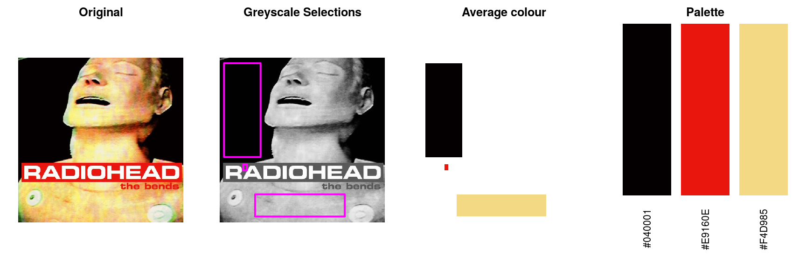
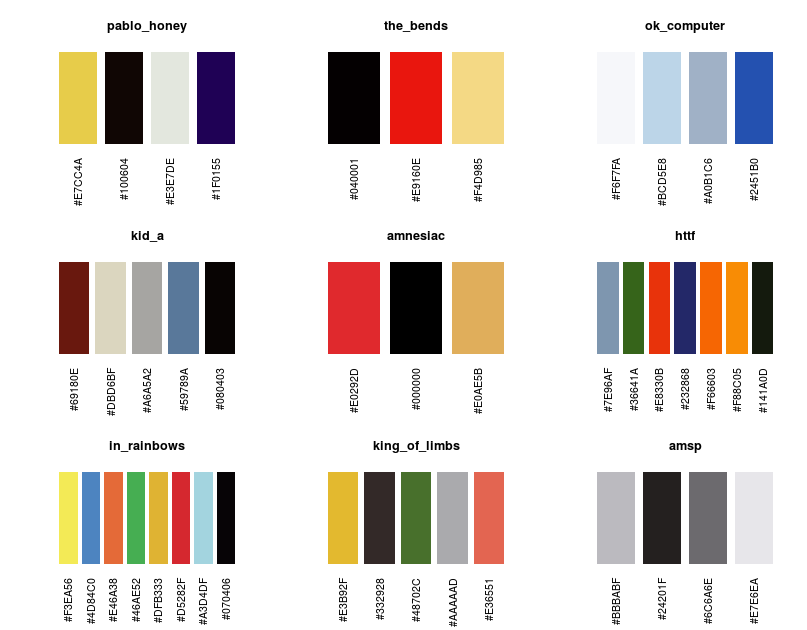

<!-- README.md is generated from README.Rmd. Please edit that file -->

```{r, echo = FALSE}
knitr::opts_chunk$set(
  collapse = TRUE,
  comment = "#>",
  fig.path = "README-"
)
```

# inRainbows

[](https://travis-ci.org/tjconstant/inRainbows)

Radiohead album colour palettes!

I thought i'd like to have a go at producing some R colour palettes based on Radiohead album art. I got the idea from the briliant wesanderson library (https://github.com/karthik/wesanderson).

I'm using this project as both an opportuity to learn how to use GitHub whilst simultaneously learning about colour spaces and their implementation in R.

**This is massively a work in progress** with two main approaches so far...

* using Kmeans to make colour palettes in an unsupervised manner


* using manual selections in imageJ and then calculate average colours in R


## Palettes
Example palettes from the manual selection process


## Example Usage
Some example plots...here the black in the KID A palette hides the median bar :(

```{r}
library(ggplot2)
library(inRainbows)
```

```{r}
p1 <- 
ggplot(mtcars, aes(x = cyl, y = hp, group = cyl, fill = factor(cyl))) + 
  geom_boxplot() + 
  scale_fill_inRainbows(option = "ok_computer") +
  theme_bw()
```

```{r}
p2 <-
ggplot(morley, aes(x = Expt, y = Speed, group = Expt, fill = factor(Expt))) + 
  geom_boxplot() + 
  scale_fill_inRainbows(option = "kid_a") +
  theme_bw()
```

```{r example-ggplots, fig.width = 10}
gridExtra::grid.arrange(p1,p2, nrow=1)
```

In fact, I'm not sure how useful the dark (almost black) colours are...
