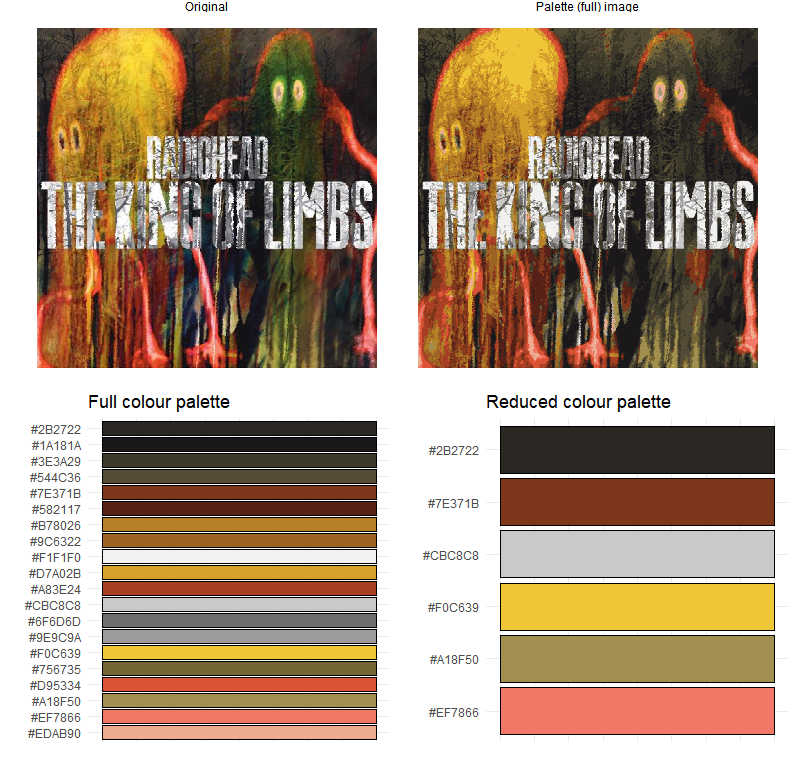

<!-- README.md is generated from README.Rmd. Please edit that file -->

```{r, include = FALSE}
knitr::opts_chunk$set(
  collapse = TRUE,
  comment = "#>",
  fig.path = "man/figures/README-",
  out.width = "100%"
)
```

# inRainbows

<!-- badges: start -->
<!-- badges: end -->

An attempt at producing R colour palettes based on Radiohead album artwork.

## Palette creation
The colour palettes are produced by first running kmeans on the RGB coordinates of the album covers with a specification that 20 groups are returned (the value of 20 groups was picked after some trial and error, as lower group numbers would sometimes result in key colours or accent colours in the album cover not being picked out).

After the palettes containing 20 colours each were produced, I manually reduced the number of colours in each palette in order to remove very visually similar (to my eye!) colours and very light (or white) colours, as they are rarely useful for visualisations (although this is something I may want to reconsider at some point). I am a bit conflicted about manually removing light colours as they are an essential part of the palette that represents the album artwork. But on the other hand, white (or very light colours) in a palette make it unuseable for most plotting situations. Although it also makes me wonder wether I should remove the very dark (black) colours.

### Example palette creation
The two examples below show the original album cover, the album cover recreated from only the 20 colours picked from the kmeans clustering, the 20 colour palette and the final (manually) reduced palette.

### The bends


### King of limbs


## Package useage
Add package to search path
```{r}
library(inRainbows)
```

Visualise all palettes with `inrainbows_summary()`
```{r}
inrainbows_summary()
```

Palette colours can be generated with `inrainbows("album", n)`
```{r}
inrainbows("ok_computer", 3)
```

Palettes can be used with ggplot by using `scale_fill_inrainbows()` and `scale_colour_inrainbows()`
```{r}
library(ggplot2)

ggplot(morley, aes(Expt, Speed, fill = factor(Expt))) +
  geom_boxplot() +
  scale_fill_inrainbows("kid_a", guide=FALSE)
```

