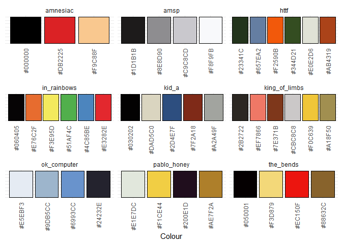

<!-- README.md is generated from README.Rmd. Please edit that file -->

# inRainbows

<!-- badges: start -->

<!-- badges: end -->

``` r
library(inRainbows)

inrainbows_summary()
```



## The bends


## King of limbs


