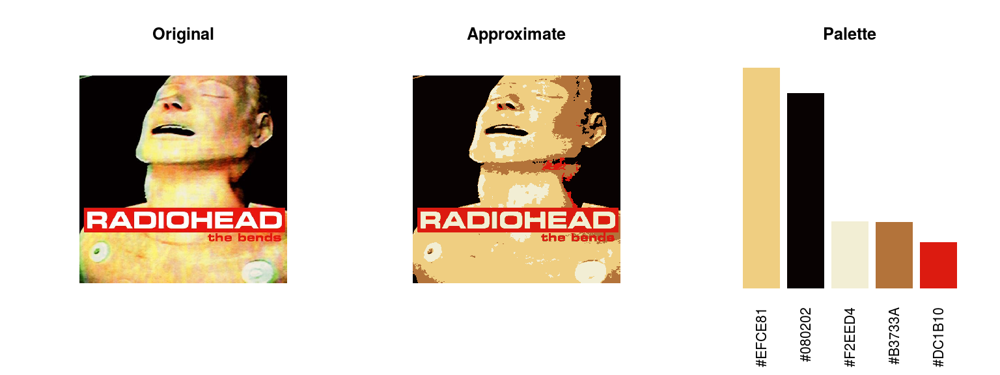
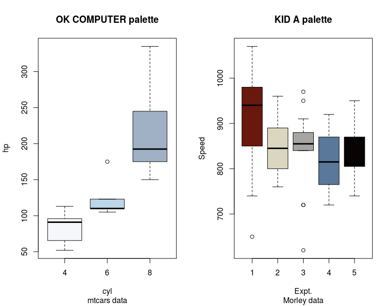

# inRainbows
Radiohead album colour palettes.

I thought i'd like to have a go at producing some R colour palettes based on Radiohead album art. I got the idea from the briliant wesanderson library (https://github.com/karthik/wesanderson).

I'm using this project as both an opportuity to learn how to use GitHub whilst simultaneously learning about colour spaces and their implementation in R.

**This is massively a work in progress** with two main approaches so far...

* using Kmeans to make colour palettes in an unsupervised manner

* using manual selections in imageJ and then calculate average colours in R

## Palettes
Example palettes from the manual selection process

## Example plots
Some example plots...here the black in the KID A palette hides the median bar :(
In fact, I'm not sure how useful the dark (almost black) colours are...
